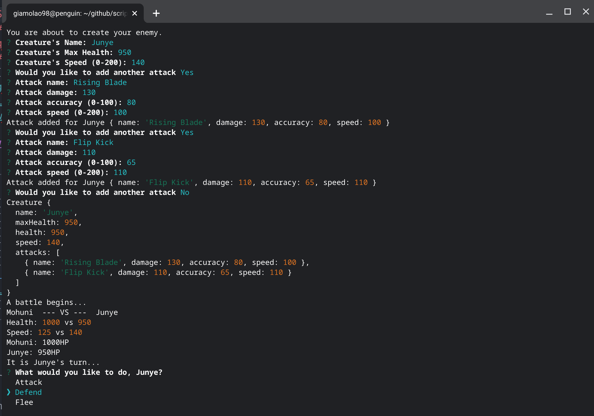

# Scrip-T-Mon
##### A JavaScript, pokemon-esque, text-based game.
### License

*Click link for license details.*

---------------
## Table of Contents
* [Installation](#installation)
* [Usage](#usage)
* [Credits](#credits)
* [Features](#features)
* [Contribution Guidelines](#contribution-guidelines)
* [Questions](#questions)
---------------
## Installation
1. Download/unzip the files.
2. 'npm install' in the root directory.
3. 'node index.js' to launch the game.
## Usage
Create Creatures to fight in epic battles!

## Credits
[Giamo Lao](https://www.github.com/TechnicalParadox)
## Features
* Creatures have health and speed attributes as well as up to 4 attacks.
* Creatures fight to the death in battles.
* More to be added!
## Contribution Guidelines
Feel free to add features to the game if you wish! Just follow these basic guidelines!
[The Contributor Covenant](https://www.contributor-covenant.org/)
## Questions
Any questions should be directed to 

[Giamo Lao](https://technicalparadox.github.io)

[giamolao98@gmail.com](mailto:https://technicalparadox.github.io)